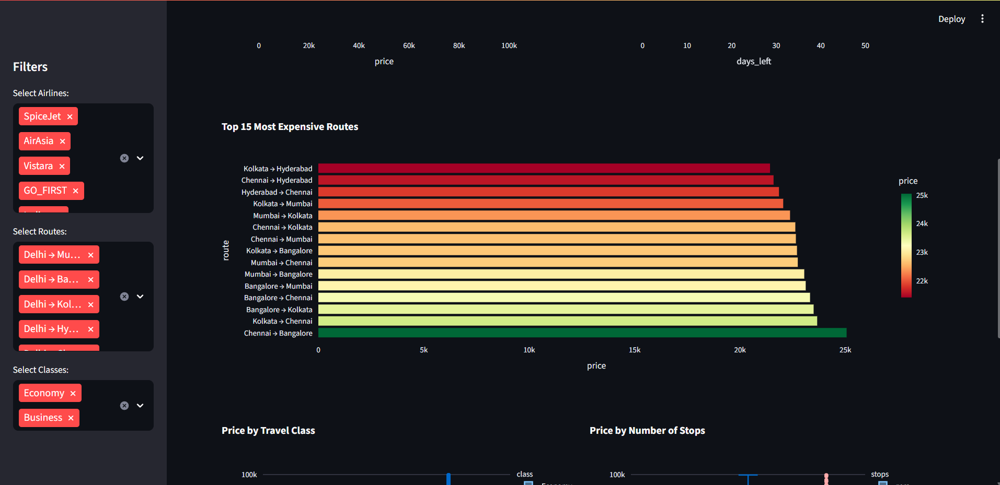

# ✈ Airline Ticket Pricing Analysis & Interactive Dashboard

## 📖 Introduction
This project delivers an **end-to-end data analysis** and **interactive dashboard** for airline ticket pricing trends using **Python**.  
It combines **data preprocessing**, **exploratory data analysis (EDA)**, **statistical testing**, and **machine learning** to uncover actionable insights in airline pricing patterns.  
A **Streamlit-based dashboard** is included for **real-time, user-driven exploration** of the data.

---

## 🎯 Project Objective
- Analyze pricing trends by airline, route, class, booking window, and stops.
- Identify factors affecting ticket prices.
- Build an interactive dashboard for dynamic data exploration.
- Provide business recommendations for airlines, agencies, and travelers.

---

## 📂 Project Structure
**airline-ticket-pricing**

- airline_analysis.ipynb # Jupyter Notebook for analysis
- airline_cleaned.csv # Cleaned dataset
 - dashboard.py # Streamlit dashboard script
- requirements.txt # Python dependencies
- images/ # Folder for screenshots
- README.md # Project documentation

---

## 📊 Dataset Description
- **Source:** Internal airline dataset (can be replaced with public dataset).
- **Size:** ~300,000 rows × 12 columns.

| Column            | Description                              |
|-------------------|------------------------------------------|
| airline           | Airline name                             |
| flight            | Flight code                              |
| source_city       | Departure city                           |
| departure_time    | Time of departure                        |
| stops             | Number of stops (zero/one/two)           |
| arrival_time      | Time of arrival                          |
| destination_city  | Arrival city                             |
| class             | Travel class (Economy/Business)          |
| duration          | Flight duration (hours)                  |
| days_left         | Days before departure                    |
| price             | Ticket price (₹)                         |

---

## 🛠 Methodology

### 1. Data Cleaning
- Removed duplicates and handled missing values.
- Standardized column names and data types.
- Converted numeric and datetime columns.
- Created **route** column: `source_city → destination_city`.

### 2. Exploratory Data Analysis (EDA)
- Price distribution across airlines.
- Price variation with booking lead time (`days_left`).
- Class-wise price comparison.
- Route-level pricing patterns.
- Flight duration vs. price correlation.

### 3. Statistical Testing
- **ANOVA** to test mean price differences across airlines and classes.
- **T-tests** for Economy vs Business fares.

### 4. Machine Learning
- **Random Forest model** to predict ticket prices.
- Feature importance analysis to identify key pricing drivers.

### 5. Dashboard Development
- Interactive **Streamlit dashboard** with sidebar filters.
- KPIs and visualizations updating dynamically.
- *(Optional)* Price prediction form for custom flight details.

---

## 📌 Key Insights
- **Cheapest booking window:** ~45–50 days before departure.  
- **Most expensive booking window:** ~2 days before departure.  
- **Class price difference:**  
  - Economy median ≈ ₹5,772  
  - Business median ≈ ₹53,164  
- **Lowest average price airline:** AirAsia (~₹4,091).  
- **Highest average price airline:** Vistara (~₹30,397).  
- **Most expensive route:** Chennai → Bangalore (~₹25,082 avg).  
- Weak positive correlation (~0.20) between flight duration and price.

---

## 📸 Screenshots

**Dashboard Overview**





---

## Clone the Repository 

```bash
git clone https://github.com/nishanthselvakumar1302/airline-ticket-pricing.git
cd airline-ticket-pricing
